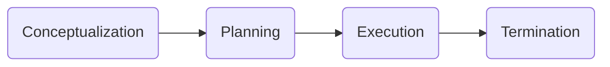
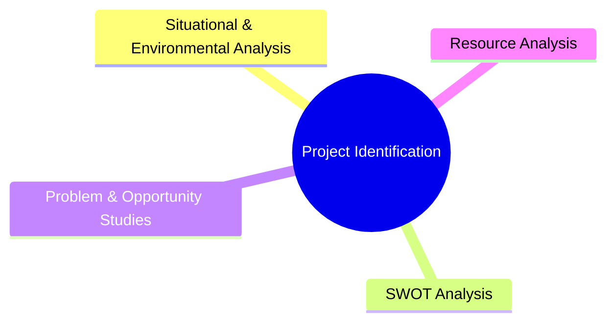
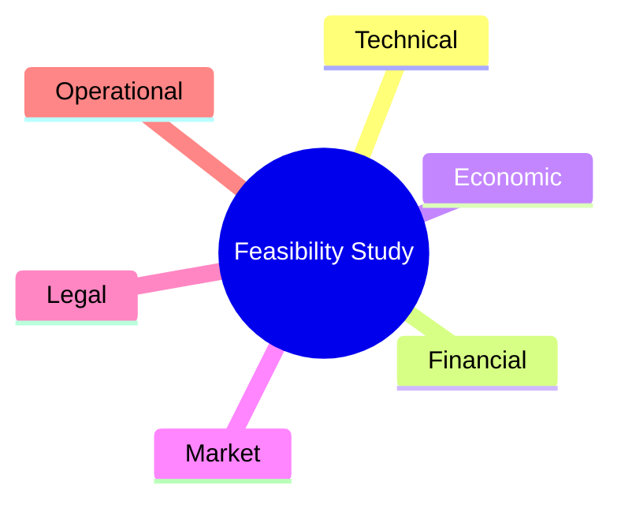
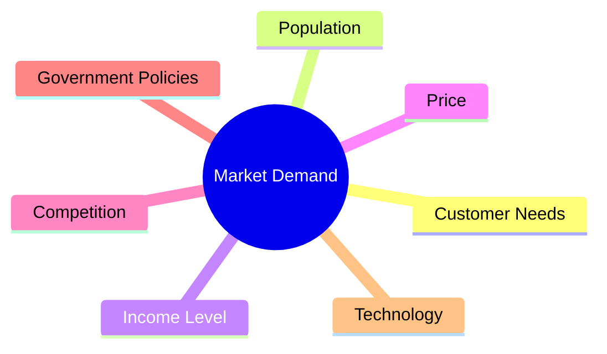
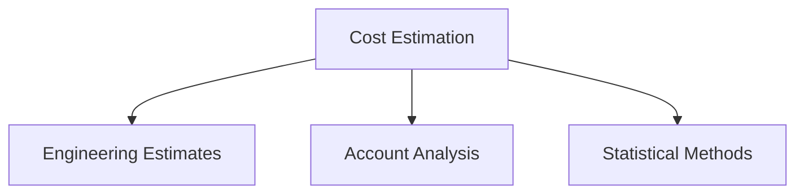
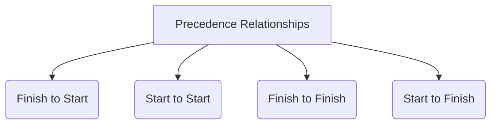
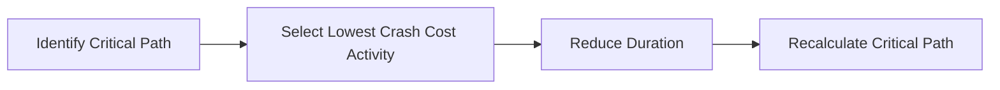

> [!info] Syllabus Coverage
> - Project Overview
> - Project Definition
> - Project Characteristics
> - Project Performance Dimensions
> - Project Identification (Introduction)
> - Feasibility Studies (Introduction)

---

# Project Management

## Definition

Project Management is the **application of knowledge, skills, tools and techniques** to project activities in order to achieve project objectives efficiently.

> [!note]
> Project management has emerged as a distinct area of management due to globalization, rapid technological advancement, increasing competition and stakeholder quality expectations.

---

# Project

## Definition (ANSI/PMI)

> **A project is a temporary endeavour undertaken to create a unique product, service or result.**

### Another Definition

A project is a **unique process consisting of coordinated and controlled activities with definite start and finish dates**, undertaken to achieve a specific objective within the constraints of:

- Time
- Cost
- Resources

---

# Characteristics of a Project

| Characteristic                     |
| ---------------------------------- |
| Unique                             |
| Specific Objective                 |
| work carried out in several stages |
| has a pre-determined timespan      |
| Non - routine tasks involved       |
| Cross-functional                   |
| Planning                           |

> [!important]
> **Exam Question (2 Marks):**
>
> List any four characteristics of a project.

---

# Project Performance Dimensions (Triple Constraint)

![[Pasted image 20260806181611.png]]

The performance of a project depends on three interrelated dimensions:

- Scope
- Time
- Cost

### Relationship

- Increasing **Scope** increases **Time** and **Cost**.
- Reducing **Time** may increase **Cost**.
- Reducing **Cost** may reduce **Scope** or extend **Time**.

> [!tip]
> This is also known as the **Quality Triangle** or **Triple Constraint**.

### Formula

```text
Performance = f(Scope, Cost, Time)
```

---

# Project Life Cycle (Overview)

Although not explicitly listed in the syllabus, the material introduces the project life cycle as part of the project overview.



## 1. Conceptualization

Activities include:

- Identification of project idea
- Pre-feasibility study
- Feasibility study
- Appraisal
- Approval

Deliverable:
- Project proposal

---

## 2. Planning

Main activities:

- Activity identification
- Activity sequencing
- Time scheduling
- Budget estimation
- Staffing
- Resource allocation

Deliverable:
- Detailed Project Report (DPR)

---

## 3. Execution

Main activities:

- Implement project plans
- Monitor progress
- Control cost
- Control schedule
- Maintain quality
- Communicate with stakeholders

---

## 4. Termination

Activities include:

- Project completion
- Handover
- Follow-up
- Evaluation

---

# Project Identification

## Definition

Project Identification is the process of recognizing a project opportunity that can satisfy a particular need or solve a specific problem.

### Sources of Project Ideas

- Market demand
- Customer requirements
- Government policies
- Technological developments
- Resource availability
- Social needs


## Project Identification

### Objective

- Assess initially if the project is a good project.
- Assess initially if the project makes sense.
- Start with a useful and feasible project concept.
- Avoid wasting time and resources on projects that have little chance of succeeding. :contentReference[oaicite:0]{index=0}

---

### Tools Used



### Situational & Environmental Analysis

Studies the **internal and external environment** affecting the project.
* Trends
* customer segmentation
* distibution channels
* actual n potential market size
* 
### SWOT Analysis

| Strengths | Weaknesses |
|------------|------------|
| Internal advantages | Internal limitations |

| Opportunities | Threats |
|--------------|---------|
| External favourable factors | External risks |

### Problem & Opportunity Studies

- Identifies existing problems.
- Identifies business opportunities.
- Helps decide whether the project is worth pursuing.

### Resource Analysis

Checks availability of:

- 👨‍💼 Manpower
- 💰 Finance
- 🖥 Technology
- 🏗 Infrastructure
- 📦 Materials
---

# Feasibility Study

## Definition

A **feasibility study** is conducted to determine whether a proposed project is **practical, viable and worth implementing** before significant investment is made.

> [!important]
> Feasibility studies are performed during the **Conceptualization Phase** of the project life cycle.

---

## Objectives of Feasibility Study

- Determine project viability
- Identify risks
- Estimate cost
- Assess expected benefits
- Support investment decisions

---

## Types of Feasibility



### Technical Feasibility

Checks whether:

- Technology exists
- Required equipment is available
- Skilled manpower is available

---

### Financial Feasibility

Determines:

- Project cost
- Funding sources
- Expected return
- Profitability

---

### Market Feasibility

Determines:

- Market demand
- Customer acceptance
- Competition
- Future sales

---

### Economic Feasibility

Evaluates whether the project benefits society and the economy.

---

### Legal Feasibility

Ensures compliance with:

- Government regulations
- Environmental laws
- Labour laws
- Licensing requirements

---

### Operational Feasibility

Determines whether the organization can successfully operate and maintain the project after implementation.

---

> [!summary]
> **Remember**
>
> A feasibility study answers one fundamental question:
>
> **"Should this project be undertaken?"**


# Market and Demand Analysis

## Definition

Market and Demand Analysis is the process of studying the **market potential, customer demand, competition, and future sales** before starting a project.

> [!important]
> It helps determine whether there is sufficient demand for the proposed project.


---

## Factors Affecting Market Demand



---

## Market Analysis Includes

- Target customers
- Customer segmentation
- Existing competitors
- Distribution channels
- Market trends
- Potential market size
- Future demand forecasting

## Key Steps of Market & Demand Analysis

![[Pasted image 20260806183535.png]]

### Explanation of Each Step

### 1. Situational Analysis & Specification of Objectives

- Understand the current market situation.
- Identify the purpose of the project.
- Define business objectives and customer needs.

---

### 2. Collection of Secondary Information

Secondary information is data that has **already been collected** by others.

Examples:

- Government reports
- Census data
- Industry reports
- Company records
- Research papers

> [!note]
> Secondary data is inexpensive and helps understand the market before conducting surveys.

---

### 3. Conduct of Market Survey

Primary data is collected directly from potential customers.

Methods include:

- Questionnaires
- Interviews
- Observation
- Online surveys
- Focus groups

Purpose:

- Understand customer preferences.
- Estimate demand.
- Study buying behaviour.

---

### 4. Characterization of the Market

Analyse the collected information to understand the market.

Includes:

- Market size
- Customer segments
- Competitors
- Distribution channels
- Market trends
- Growth potential

---

### 5. Demand Forecasting

Estimate the future demand for the product or service.

Factors considered:

- Population growth
- Income levels
- Customer preferences
- Economic conditions
- Seasonal demand

> [!important]
> Demand forecasting helps estimate future sales and production requirements.

---

### 6. Market Planning

Based on the analysis, prepare the marketing strategy.

Includes:

- Target market
- Pricing strategy
- Promotion
- Distribution channels
- Sales targets

---

> [!summary]
> **Flow of Market & Demand Analysis**
>
> **Analyse Current Situation**
> → **Collect Existing Information**
> → **Conduct Market Survey**
> → **Study the Market**
> → **Forecast Demand**
> → **Prepare Market Plan**

> [!tip]
> Market Analysis answers:
>
> **"Will customers buy our product or service?"**

## Methods of Demand Forecasting

> [!summary]
> 
>
> **Qualitative**
> - Delphi Method
> - Jury of Executive Opinion
>
> **Projection**
> - Moving Average
> - Time Series Analysis
> - Exponential Smoothing
>
> **Causal**
> - Chain Ratio Method
> - Consumption Level Method
> - End-use Method
> - Leading Indicator Method


---

### 1. Qualitative Methods

Used when **historical data is unavailable**. Based on expert opinions and judgment.

- **Delphi Method** – Anonymous expert opinions collected through multiple rounds until consensus is reached.
- **Jury of Executive Opinion** – Forecast prepared based on the collective opinion of experienced executives.

---

### 2. Projection Methods

Uses **historical demand data** to predict future demand.

- **Moving Average** – Forecast based on the average demand of previous periods.
- **Time Series Analysis** – Forecast using trend, seasonal, cyclical and random variations.
- **Exponential Smoothing** – Gives more weight to recent observations.

---

### 3. Causal Methods

Forecast demand by analysing **factors influencing demand**.

- **Chain Ratio Method** – Estimates demand using a sequence of percentage adjustments.
- **Consumption Level Method** – Forecast based on past consumption patterns.
- **End-use Method** – Estimates demand by analysing different end-use sectors.
- **Leading Indicator Method** – Uses leading economic indicators to predict future demand.

## UNCERTAINTIES IN DEMAND FORECASTING
* Env changes
* tech changes
* changes in govt policies

# Project Cost Estimate

## Definition

Project Cost Estimation is the process of estimating the **total expenditure required** to complete a project successfully.

---


## Types of Costs


### Fixed Cost

- Does not change with activity level.
- Example:
    - Rent
    - Insurance
    - Salaries

### Variable Cost

- Changes according to project activity.
- Example:
    - Materials
    - Labour
    - Fuel

---

## Cost Estimation Methods



### 1. Engineering Estimates

Cost estimates are based on measuring and then pricing the work involved in a task.
Estimate the time and cost for each activity.

activities involved:

– Labor

– Rent

-- Insurance


### 2. Account Analysis

Each cost is classified as:

- Fixed
- Variable

Formula

```text
Total Cost = Fixed Cost + (Variable Cost × Number of Units)
```

---

### 3. Statistical Methods

Uses historical data.

Methods include:

- Scatter Graph
- Hi-Low Method
- Regression Analysis

---

## Hi-Low Method

Variable Cost

```text
VC = (Highest Cost − Lowest Cost)
     -----------------------------
    Highest Activity − Lowest Activity
```

Total Cost

```text
TC = Fixed Cost + (Variable Cost × Units)
```

---

## Regression Equation

```text
Y = a + bX

Y = Total Cost
a = Fixed Cost
b = Variable Cost per Unit
X = Activity Level
```

---

# Financial Appraisal

## Definition

Financial Appraisal is the process of evaluating whether a project is **financially profitable and economically viable** before investment.

> [!important]
> Financial Appraisal answers:
>
> **"Is the project worth investing in?"**

---

![[Pasted image 20260806184723.png]]


## 1. Non-Discounting Cash Flow Methods

These methods **do not consider the time value of money**.

Methods include:

- Payback Period (PBP)
- Accounting Rate of Return (ARR)

---

## 2. Discounting Cash Flow (DCF) Methods

These methods **consider the time value of money** by discounting future cash flows.

Methods include:

- Net Present Value (NPV)
- Internal Rate of Return (IRR)
- Profitability Index (PI)

> [!tip]
> **Easy way to remember**
>
> **Non-Discounting** → Ignores Time Value of Money (TVM)
>
> **Discounting (DCF)** → Considers Time Value of Money (TVM)


This follows your staff's slide exactly:

- Financial Appraisal → Investment Criteria → **2 Categories**
- Non-Discounting Cash Flow Methods
- Discounting Cash Flow


# Project Scheduling

## Definition

Project Scheduling is the process of determining:

- Activity sequence
- Start time
- Finish time
- Duration
- Resource allocation

---

## Objectives

- Complete project on time
- Improve resource utilization
- Monitor project progress
- Reduce delays

---

# PERT (Program Evaluation and Review Technique)

## Definition

PERT is a **network scheduling technique** used when activity durations are **uncertain**.

### Time Estimates

- Optimistic (O)
- Most Likely (M)
- Pessimistic (P)


Formula


```text
Expected Time = (O + 4M + P) / 6
```

---

# CPM (Critical Path Method)

## Definition

CPM is a scheduling technique used when **activity durations are known with certainty**.

Main objective:

- Identify Critical Path
- Optimize Time and Cost

---

# PERT vs CPM

| PERT | CPM |
|------|------|
| Probabilistic | Deterministic |
| Uncertain time | Known time |
| Uses 3 estimates | Uses 1 estimate |
| Time-oriented | Time & Cost-oriented |
| R&D Projects | Construction Projects |

---

# Precedence Relationship

Activities can have four dependency types.



### Finish to Start (FS)

Successor starts only after predecessor finishes.

### Start to Start (SS)

Successor starts when predecessor starts.

### Finish to Finish (FF)

Both activities finish together.

### Start to Finish (SF)

Rare dependency.

---

# Critical Path

## Definition

Critical Path is the **longest path** in a project network.

Activities on the Critical Path have:

- Zero Float
- Zero Slack

```text
A ---- B ---- D

 \

  C ---- E

Critical Path = Longest Path
```

---

# Float (Slack)

## Definition

Float is the amount of time an activity can be delayed **without affecting project completion**.

### Formula

```text
Total Float = LS − ES

OR

Total Float = LF − EF
```

### Importance

- Identifies scheduling flexibility
- Helps resource planning
- Determines Critical Path

---

# Cost Reduction by Crashing

## Definition

Crashing is the process of **reducing project duration by allocating additional resources at extra cost.**

---

## Steps



---

## Advantages

- Faster project completion
- Avoid delay penalties
- Better resource utilization

## Disadvantages

- Increased project cost
- Additional resource requirement

> [!summary]
> Crash only **Critical Path activities**, because reducing non-critical activities does not reduce the overall project duration.